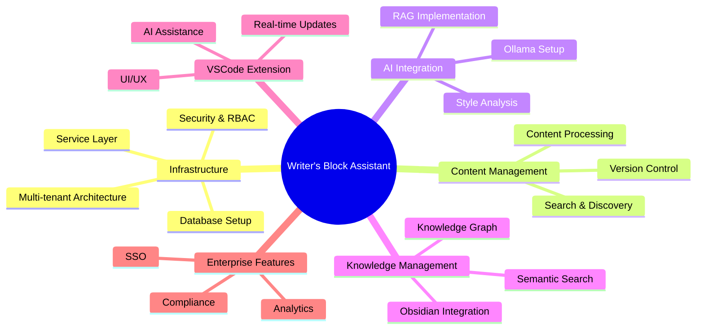

# Writer's Block Assistant - Agile Backlog
## Project Overview
Following Semantic Seed Venture Studio's XP-oriented development standards with focus on BDD/TDD.

## Epic Structure


## Development Workflow
1. **Story Selection**
   - Pick top unstarted story from backlog
   - Create branch: `feature/{id}`, `bug/{id}`, or `chore/{id}`

2. **TDD Process**
   - Write failing tests (WIP: Red Tests)
   - Implement code (WIP: Green Tests)
   - Refactor and commit (Refactor complete)

3. **PR Process**
   - Mark story Finished
   - Create PR with build trigger
   - Review and merge
   - Mark Delivered

4. **Story Completion**
   - PM Review
   - Accept/Reject based on criteria

## Epics and User Stories

### Epic 1: Infrastructure Foundation
**Type**: Feature
**Value Statement**: Enable secure, scalable multi-tenant operations with proper access controls
**Security Impact**: High - Handles sensitive user data and authentication

#### Stories
1. **Tenant Schema Setup** (3 points)
   *Type*: Feature
   *Branch*: `feature/MT-001`
   
   **BDD Scenarios**:
   ```gherkin
   Feature: Tenant Schema Creation
   
   Scenario: Creating tenant schema
     Given I am a system administrator
     When I create a new tenant
     Then a dedicated schema should be created
     And proper permissions should be set
   
   Scenario: Schema validation
     Given a new tenant schema
     When I run validation checks
     Then all required tables should exist
     And indexes should be properly configured
   ```
   
   **User Stories**:
   - As a system architect, I need to create isolated tenant schemas
   - As a DBA, I need to verify schema integrity
   
   **Acceptance Criteria**:
   - [ ] Automated schema creation
   - [ ] Permission setup
   - [ ] Schema validation tests
   
   **Testing Strategy**:
   1. Unit Tests: Schema operations
   2. Integration Tests: Permission setup
   3. Validation Tests: Schema integrity

2. **Tenant Configuration API** (2 points)
   *Type*: Feature
   *Branch*: `feature/MT-002`
   
   **BDD Scenarios**:
   ```gherkin
   Feature: Tenant Configuration
   
   Scenario: Setting tenant config
     Given I am a tenant administrator
     When I update configuration settings
     Then the changes should be saved
     And an audit log should be created
   ```
   
   **User Stories**:
   - As an admin, I need to manage tenant settings
   - As an auditor, I need configuration change logs
   
   **Acceptance Criteria**:
   - [ ] Configuration API endpoints
   - [ ] Validation middleware
   - [ ] Audit logging
   
   **Testing Strategy**:
   1. Unit Tests: API endpoints
   2. Integration Tests: Middleware
   3. Audit Tests: Logging

3. **Tenant Data Isolation** (3 points)
   *Type*: Feature
   *Branch*: `feature/MT-003`
   
   **BDD Scenarios**:
   ```gherkin
   Feature: Data Isolation
   
   Scenario: Cross-tenant access prevention
     Given I am authenticated as Tenant A
     When I try to access Tenant B's data
     Then I should receive an access denied error
     And the attempt should be logged
   ```
   
   **User Stories**:
   - As a security officer, I need complete data isolation
   - As an auditor, I need access attempt logs
   
   **Acceptance Criteria**:
   - [ ] Row-level security policies
   - [ ] Access control middleware
   - [ ] Security event logging
   
   **Testing Strategy**:
   1. Security Tests: Access control
   2. Performance Tests: RLS impact
   3. Integration Tests: Middleware

4. **Role Management API** (3 points)
   *Type*: Feature
   *Branch*: `feature/RBAC-001`
   
   **BDD Scenarios**:
   ```gherkin
   Feature: Role Management
   
   Scenario: Creating a new role
     Given I am a system administrator
     When I create a new role with permissions
     Then the role should be saved
     And permissions should be correctly assigned
   
   Scenario: Role validation
     Given I am creating a role
     When I specify invalid permissions
     Then I should receive an error
     And the role should not be created
   ```
   
   **User Stories**:
   - As an admin, I need to manage roles
   - As a security officer, I need role validation
   
   **Acceptance Criteria**:
   - [ ] Role CRUD API endpoints
   - [ ] Permission validation
   - [ ] API documentation
   
   **Testing Strategy**:
   1. Unit Tests: API operations
   2. Integration Tests: Validation
   3. API Tests: Documentation

5. **Permission Assignment** (2 points)
   *Type*: Feature
   *Branch*: `feature/RBAC-002`
   
   **BDD Scenarios**:
   ```gherkin
   Feature: Permission Assignment
   
   Scenario: Assigning permissions
     Given I am a role administrator
     When I assign permissions to a role
     Then the permissions should be updated
     And changes should be logged
   ```
   
   **User Stories**:
   - As an admin, I need to manage permissions
   - As an auditor, I need assignment logs
   
   **Acceptance Criteria**:
   - [ ] Permission assignment API
   - [ ] Validation rules
   - [ ] Audit logging
   
   **Testing Strategy**:
   1. Unit Tests: Assignment logic
   2. Security Tests: Validation
   3. Audit Tests: Logging

6. **Role Hierarchy** (3 points)
   *Type*: Feature
   *Branch*: `feature/RBAC-003`
   
   **BDD Scenarios**:
   ```gherkin
   Feature: Role Hierarchy
   
   Scenario: Permission inheritance
     Given I have a role with inherited permissions
     When I check the effective permissions
     Then I should see all inherited permissions
     And the inheritance chain should be traceable
   ```
   
   **User Stories**:
   - As an architect, I need role inheritance
   - As an admin, I need hierarchy visibility
   
   **Acceptance Criteria**:
   - [ ] Inheritance model
   - [ ] Cycle detection
   - [ ] Permission resolution
   
   **Testing Strategy**:
   1. Unit Tests: Inheritance logic
   2. Graph Tests: Cycle detection
   3. Performance Tests: Resolution

7. **Vector Storage Setup** (3 points)
   *Type*: Feature
   *Branch*: `feature/DB-001`
   
   **BDD Scenarios**:
   ```gherkin
   Feature: Vector Storage
   
   Scenario: Setting up pgvector
     Given I have a PostgreSQL database
     When I configure the pgvector extension
     Then vector operations should be available
     And index creation should succeed
   
   Scenario: Vector operations
     Given I have vector data
     When I perform similarity search
     Then results should be ordered by relevance
     And performance should meet SLA
   ```
   
   **User Stories**:
   - As a developer, I need vector storage
   - As an SRE, I need performance monitoring
   
   **Acceptance Criteria**:
   - [ ] pgvector extension setup
   - [ ] Vector operations testing
   - [ ] Performance benchmarks
   
   **Testing Strategy**:
   1. Unit Tests: Vector operations
   2. Performance Tests: Search latency
   3. Integration Tests: Extension setup

8. **Data Partitioning** (3 points)
   *Type*: Feature
   *Branch*: `feature/DB-002`
   
   **BDD Scenarios**:
   ```gherkin
   Feature: Data Partitioning
   
   Scenario: Partition creation
     Given I have a large dataset
     When I implement the partition strategy
     Then data should be correctly distributed
     And query performance should improve
   ```
   
   **User Stories**:
   - As an architect, I need data partitioning
   - As a DBA, I need partition management
   
   **Acceptance Criteria**:
   - [ ] Partition strategy
   - [ ] Automated partition management
   - [ ] Performance metrics
   
   **Testing Strategy**:
   1. Unit Tests: Partition logic
   2. Performance Tests: Query impact
   3. Load Tests: Data distribution

9. **Backup & Recovery** (3 points)
   *Type*: Feature
   *Branch*: `feature/DB-003`
   
   **BDD Scenarios**:
   ```gherkin
   Feature: Backup and Recovery
   
   Scenario: Automated backup
     Given I have configured backup settings
     When the backup schedule runs
     Then data should be safely stored
     And backup logs should be created
   
   Scenario: Data recovery
     Given I have a backup
     When I perform recovery
     Then data should be restored
     And integrity should be verified
   ```
   
   **User Stories**:
   - As an admin, I need backup automation
   - As an SRE, I need recovery procedures
   
   **Acceptance Criteria**:
   - [ ] Backup automation
   - [ ] Recovery procedures
   - [ ] Documentation
   
   **Testing Strategy**:
   1. Integration Tests: Backup process
   2. Recovery Tests: Restore procedures
   3. Documentation Tests: Runbooks

### Epic 2: Content Management
**Type**: Feature
**Value Statement**: Provide robust content handling with version control and discovery
**Security Impact**: Medium - Handles user content and version history

#### Stories
1. **Version History Core** (3 points)
   *Type*: Feature
   *Branch*: `feature/CMS-001`
   
   **BDD Scenarios**:
   ```gherkin
   Feature: Version History
   
   Scenario: Creating version
     Given I am an authenticated writer
     When I save document changes
     Then a new version should be created
     And metadata should be recorded
   
   Scenario: Listing versions
     Given I have a document
     When I view version history
     Then I should see all versions
     And their metadata
   ```
   
   **User Stories**:
   - As a writer, I need version tracking
   - As a user, I need version metadata
   
   **Acceptance Criteria**:
   - [ ] Version creation API
   - [ ] Metadata storage
   - [ ] History listing
   
   **Testing Strategy**:
   1. Unit Tests: Version operations
   2. Integration Tests: API endpoints
   3. UI Tests: History display

2. **Version Comparison** (2 points)
   *Type*: Feature
   *Branch*: `feature/CMS-002`
   
   **BDD Scenarios**:
   ```gherkin
   Feature: Version Comparison
   
   Scenario: Comparing versions
     Given I have multiple versions
     When I select two for comparison
     Then I should see the differences
     And changes should be highlighted
   ```
   
   **User Stories**:
   - As an editor, I need version comparison
   - As a user, I need diff visualization
   
   **Acceptance Criteria**:
   - [ ] Diff generation
   - [ ] Accessible visualization
   - [ ] Change highlighting
   
   **Testing Strategy**:
   1. Unit Tests: Diff logic
   2. UI Tests: Visualization
   3. A11y Tests: Accessibility

3. **Version Restoration** (3 points)
   *Type*: Feature
   *Branch*: `feature/CMS-003`
   
   **BDD Scenarios**:
   ```gherkin
   Feature: Version Restoration
   
   Scenario: Restoring version
     Given I am viewing history
     When I restore a version
     Then content should revert
     And a restoration marker created
   
   Scenario: Vector updating
     Given I restore a version
     When the content changes
     Then vectors should update
     And RAG index should refresh
   ```
   
   **User Stories**:
   - As a user, I need version restoration
   - As a dev, I need vector maintenance
   
   **Acceptance Criteria**:
   - [ ] Restoration API
   - [ ] Vector updates
   - [ ] RAG integration
   
   **Testing Strategy**:
   1. Unit Tests: Restore logic
   2. Integration Tests: Vector updates
   3. E2E Tests: Full workflow
   - [ ] Version restoration with audit logging
   - [ ] Conflict resolution with merge support
   - [ ] Vector storage for versioned content
   
   **Testing Strategy**:
   1. Unit Tests: Version management operations
   2. Integration Tests: Version comparison and restoration
   3. Performance Tests: Vector operations
   4. Accessibility Tests: Diff viewer compliance

4. **Format Conversion** (3 points)
   *Type*: Feature
   *Branch*: `feature/CMS-004`
   
   **BDD Scenarios**:
   ```gherkin
   Feature: Format Conversion
   
   Scenario: Converting formats
     Given I have content in <format>
     When I submit for conversion
     Then it should convert to standard format
     And metadata should be preserved
     Examples:
       | format    |
       | markdown  |
       | plaintext |
       | html      |
   ```
   
   **User Stories**:
   - As a writer, I need format conversion
   - As a dev, I need metadata preservation
   
   **Acceptance Criteria**:
   - [ ] Format converters
   - [ ] Metadata handling
   - [ ] Error reporting
   
   **Testing Strategy**:
   1. Unit Tests: Converters
   2. Integration Tests: Pipeline
   3. Error Tests: Edge cases

5. **Content Validation** (2 points)
   *Type*: Feature
   *Branch*: `feature/CMS-005`
   
   **BDD Scenarios**:
   ```gherkin
   Feature: Content Validation
   
   Scenario: Validation rules
     Given I submit content
     When validation runs
     Then I should get error messages
     And get suggested fixes
   ```
   
   **User Stories**:
   - As a user, I need content validation
   - As a writer, I need fix suggestions
   
   **Acceptance Criteria**:
   - [ ] Validation rules
   - [ ] Error messages
   - [ ] Fix suggestions
   
   **Testing Strategy**:
   1. Unit Tests: Rules
   2. Integration Tests: Messages
   3. UX Tests: Suggestions

6. **Content Analysis** (3 points)
   *Type*: Feature
   *Branch*: `feature/CMS-006`
   
   **BDD Scenarios**:
   ```gherkin
   Feature: Content Analysis
   
   Scenario: Analyzing content
     Given I have processed content
     When I request analysis
     Then I get readability metrics
     And SEO suggestions
   
   Scenario: Performance check
     Given I analyze large content
     When the process completes
     Then it should meet SLA
     And use efficient resources
   ```
   
   **User Stories**:
   - As an editor, I need content analysis
   - As an SRE, I need performance monitoring
   
   **Acceptance Criteria**:
   - [ ] Analysis metrics
   - [ ] SEO tools
   - [ ] Performance SLA
   
   **Testing Strategy**:
   1. Unit Tests: Metrics
   2. Performance Tests: SLA
   3. Integration Tests: Tools

### Epic 3: AI Integration
**Type**: Feature
**Value Statement**: Enable intelligent writing assistance through local AI models
**Security Impact**: High - Handles model execution and user data processing

#### Stories
1. **Ollama Service Integration** (3 points)
   *Type*: Feature
   *Branch*: `feature/AI-001`
   
   **BDD Scenarios**:
   ```gherkin
   Feature: Ollama Service
   
   Scenario: Service setup
     Given I have Ollama installed
     When I configure the service
     Then health checks should pass
     And basic operations work
   
   Scenario: Service monitoring
     Given the service is running
     When I check its status
     Then I should see health metrics
     And resource utilization
   ```
   
   **User Stories**:
   - As a dev, I need Ollama integration
   - As an SRE, I need health monitoring
   
   **Acceptance Criteria**:
   - [ ] Service configuration
   - [ ] Health checks
   - [ ] Basic monitoring
   
   **Testing Strategy**:
   1. Unit Tests: Configuration
   2. Integration Tests: Health
   3. Monitoring Tests: Metrics

2. **Model Management** (2 points)
   *Type*: Feature
   *Branch*: `feature/AI-002`
   
   **BDD Scenarios**:
   ```gherkin
   Feature: Model Management
   
   Scenario: Loading models
     Given I have model <name>
     When I load the model
     Then it should be available
     And properly versioned
     Examples:
       | name      |
       | llama2    |
       | mistral   |
   ```
   
   **User Stories**:
   - As an admin, I need model management
   - As a dev, I need version control
   
   **Acceptance Criteria**:
   - [ ] Model loading API
   - [ ] Version management
   - [ ] Resource allocation
   
   **Testing Strategy**:
   1. Unit Tests: Loading
   2. Integration Tests: Versions
   3. Resource Tests: Allocation

3. **Inference Pipeline** (3 points)
   *Type*: Feature
   *Branch*: `feature/AI-003`
   
   **BDD Scenarios**:
   ```gherkin
   Feature: Model Inference
   
   Scenario: Processing requests
     Given I have a loaded model
     When I send an inference request
     Then I get a valid response
     And within SLA time
   
   Scenario: Error handling
     Given high system load
     When a timeout occurs
     Then retry with backoff
     And notify the user
   ```
   
   **User Stories**:
   - As a user, I need reliable inference
   - As an SRE, I need error handling
   
   **Acceptance Criteria**:
   - [ ] Inference API
   - [ ] SLA monitoring
   - [ ] Error handling
   
   **Testing Strategy**:
   1. Performance Tests: SLA
   2. Chaos Tests: Errors
   3. Integration Tests: Pipeline

4. **Vector Generation** (2 points)
   *Type*: Feature
   *Branch*: `feature/AI-004`
   
   **BDD Scenarios**:
   ```gherkin
   Feature: Vector Generation
   
   Scenario: Content embedding
     Given I have new content
     When it is processed
     Then embeddings are generated
     And stored in pgvector
   
   Scenario: Error handling
     Given embedding generation fails
     When error occurs
     Then retry with backoff
     And log the failure
   ```
   
   **User Stories**:
   - As a dev, I need content vectorization
   - As an SRE, I need error handling
   
   **Acceptance Criteria**:
   - [ ] Embedding pipeline
   - [ ] Storage integration
   - [ ] Error handling
   
   **Testing Strategy**:
   1. Unit Tests: Generation
   2. Integration Tests: Storage
   3. Error Tests: Recovery

5. **Similarity Search** (3 points)
   *Type*: Feature
   *Branch*: `feature/AI-005`
   
   **BDD Scenarios**:
   ```gherkin
   Feature: Vector Search
   
   Scenario: Finding similar content
     Given I have a query vector
     When I search for similar content
     Then I get ranked results
     And within SLA time
   
   Scenario: Index optimization
     Given multiple vector indices
     When performing search
     Then use optimal index
     And meet performance goals
   ```
   
   **User Stories**:
   - As a user, I need fast search
   - As an SRE, I need performance
   
   **Acceptance Criteria**:
   - [ ] Search API
   - [ ] Index optimization
   - [ ] Performance SLA
   
   **Testing Strategy**:
   1. Performance Tests: SLA
   2. Load Tests: Scaling
   3. Integration Tests: API

6. **Context Ranking** (3 points)
   *Type*: Feature
   *Branch*: `feature/AI-006`
   
   **BDD Scenarios**:
   ```gherkin
   Feature: Context Ranking
   
   Scenario: Ranking results
     Given I have search results
     When I rank by relevance
     Then most relevant are first
     And scores are normalized
   
   Scenario: Performance monitoring
     Given ranking is running
     When checking metrics
     Then latency is tracked
     And alerts fire if slow
   ```
   
   **User Stories**:
   - As a user, I need relevant results
   - As an SRE, I need monitoring
   
   **Acceptance Criteria**:
   - [ ] Ranking algorithm
   - [ ] Monitoring system
   - [ ] Alert configuration
   
   **Testing Strategy**:
   1. Unit Tests: Ranking
   2. Quality Tests: Relevance
   3. Monitor Tests: Alerts

7. **Style Profiling** (2 points)
   *Type*: Feature
   *Branch*: `feature/AI-007`
   
   **BDD Scenarios**:
   ```gherkin
   Feature: Style Profile Creation
   
   Scenario: Profile generation
     Given I have writing samples
     When I request profile creation
     Then patterns are analyzed
     And stored as vectors
   
   Scenario: Profile updates
     Given I have new samples
     When profile is updated
     Then vectors are merged
     And weights adjusted
   ```
   
   **User Stories**:
   - As a writer, I need style profiles
   - As a dev, I need vector storage
   
   **Acceptance Criteria**:
   - [ ] Pattern analysis
   - [ ] Vector storage
   - [ ] Profile updates
   
   **Testing Strategy**:
   1. Unit Tests: Analysis
   2. Storage Tests: Vectors
   3. Update Tests: Merging

8. **Style Checking** (3 points)
   *Type*: Feature
   *Branch*: `feature/AI-008`
   
   **BDD Scenarios**:
   ```gherkin
   Feature: Style Consistency
   
   Scenario: Real-time check
     Given I am writing
     When style is analyzed
     Then deviations are found
     And within SLA time
   
   Scenario: Suggestions
     Given style issues exist
     When generating feedback
     Then improvements shown
     And clearly explained
   ```
   
   **User Stories**:
   - As a writer, I need consistency
   - As an editor, I need metrics
   
   **Acceptance Criteria**:
   - [ ] Real-time analysis
   - [ ] Style metrics
   - [ ] Clear feedback
   
   **Testing Strategy**:
   1. Performance Tests: SLA
   2. Quality Tests: Accuracy
   3. UX Tests: Feedback

9. **Style Adaptation** (3 points)
   *Type*: Feature
   *Branch*: `feature/AI-009`
   
   **BDD Scenarios**:
   ```gherkin
   Feature: Style Transform
   
   Scenario: Content adaptation
     Given target style exists
     When adapting content
     Then style is transformed
     And meaning preserved
   
   Scenario: Quality check
     Given adapted content
     When validating changes
     Then flow is natural
     And style matches target
   ```
   
   **User Stories**:
   - As a user, I need adaptation
   - As an editor, I need quality
   
   **Acceptance Criteria**:
   - [ ] Style transform
   - [ ] Quality checks
   - [ ] Learning system
   
   **Testing Strategy**:
   1. Unit Tests: Transform
   2. Quality Tests: Output
   3. Learning Tests: Feedback

10. **Real Embedding Generation** (3 points)
   *Type*: Feature
   *Branch*: `feature/AI-010a`
   *Dependencies*: AI-001, AI-002, AI-004
   
   **BDD Scenarios**:
   ```gherkin
   Feature: Real Embedding Generation
   
   Scenario: Generate embeddings for text
     Given I have text content to embed
     When I generate vector embeddings
     Then real embeddings are created with correct dimensions
     And performance is under 1s per fragment
   
   Scenario: Integration with ModelManager
     Given ModelManager is available
     When I request embeddings with a specific model
     Then the model is loaded via ModelManager
     And embeddings are generated using that model
   
   Scenario: Error handling
     Given a model is unavailable
     When attempting to generate embeddings
     Then an appropriate error is raised
     And the error message is descriptive
   ```
   
   **User Stories**:
   - As a developer, I need real vector embeddings (not stubs)
   - As a system, I need integration with ModelManager
   - As a user, I need embeddings generated within performance SLAs
   
   **Acceptance Criteria**:
   - [ ] Real API calls to embedding models (no stubs)
   - [ ] Integration with ModelManager working correctly
   - [ ] Embeddings generated with correct dimensions
   - [ ] Performance under 1s per text fragment
   - [ ] Basic error handling implemented
   - [ ] Unit and integration tests passing
   
   **Testing Strategy**:
   1. Unit Tests: Embedding generation logic
   2. Integration Tests: ModelManager integration
   3. Performance Tests: <1s per fragment SLA
   4. Error Tests: Graceful failure handling

11. **Embedding Cache & Multi-Model** (2 points)
   *Type*: Feature
   *Branch*: `feature/AI-010b`
   *Dependencies*: AI-010a
   
   **BDD Scenarios**:
   ```gherkin
   Feature: Embedding Cache & Multi-Model
   
   Scenario: Cache frequently used embeddings
     Given I have previously embedded text
     When I request embeddings again
     Then cached embeddings are returned
     And response time is under 100ms
   
   Scenario: Multiple embedding models
     Given I have different embedding models available
     When I select a specific model
     Then embeddings use that model
     And dimensions match model specifications
   
   Scenario: Cache invalidation
     Given I have cached embeddings
     When the cache size limit is reached
     Then least recently used embeddings are evicted
     And cache remains performant
   ```
   
   **User Stories**:
   - As a system, I need caching for frequently used embeddings
   - As a developer, I need support for multiple embedding models
   - As an admin, I need cache metrics to monitor performance
   
   **Acceptance Criteria**:
   - [ ] Caching for frequently used embeddings
   - [ ] <100ms response time for cached embeddings
   - [ ] Support for multiple embedding models
   - [ ] Dynamic dimension handling per model
   - [ ] Cache hit/miss metrics tracked
   - [ ] Performance SLAs met
   
   **Testing Strategy**:
   1. Cache Tests: Hit/miss scenarios
   2. Performance Tests: <100ms for cached
   3. Multi-model Tests: Different models and dimensions
   4. Metrics Tests: Cache statistics tracking

### Epic 4: Knowledge Management
**Value Statement**: Create and maintain knowledge structures from content

#### Stories
1. **Vault Sync Core** (3 points)
   *Type*: Feature
   *Branch*: `feature/KM-001`
   
   **BDD Scenarios**:
   ```gherkin
   Feature: Vault Sync
   
   Scenario: Initial sync
     Given I have an Obsidian vault
     When I connect it
     Then files are synced
     And metadata preserved
   
   Scenario: File watching
     Given vault is connected
     When files change
     Then changes detected
     And sync triggered
   ```
   
   **User Stories**:
   - As a user, I need vault sync
   - As a dev, I need file watching
   
   **Acceptance Criteria**:
   - [ ] Vault connection
   - [ ] File sync
   - [ ] Change detection
   
   **Testing Strategy**:
   1. Unit Tests: Connection
   2. Integration Tests: Sync
   3. Watch Tests: Changes

2. **Markdown Processing** (2 points)
   *Type*: Feature
   *Branch*: `feature/KM-002`
   
   **BDD Scenarios**:
   ```gherkin
   Feature: Markdown Support
   
   Scenario: Parse markdown
     Given I have MD files
     When processing them
     Then syntax parsed
     And AST created
   
   Scenario: Format support
     Given special formats
     When processing them
     Then correctly handled
     And preserved
   ```
   
   **User Stories**:
   - As a writer, I need MD support
   - As a dev, I need parsing
   
   **Acceptance Criteria**:
   - [ ] MD parsing
   - [ ] AST generation
   - [ ] Format handling
   
   **Testing Strategy**:
   1. Unit Tests: Parser
   2. Format Tests: Special
   3. AST Tests: Structure

3. **Metadata Management** (3 points)
   *Type*: Feature
   *Branch*: `feature/KM-003`
   
   **BDD Scenarios**:
   ```gherkin
   Feature: Metadata
   
   Scenario: Extract metadata
     Given MD frontmatter
     When processing file
     Then metadata extracted
     And properly indexed
   
   Scenario: Update metadata
     Given indexed metadata
     When making changes
     Then updates propagate
     And stay consistent
   ```
   
   **User Stories**:
   - As a user, I need metadata
   - As a dev, I need indexing
   
   **Acceptance Criteria**:
   - [ ] Frontmatter parsing
   - [ ] Metadata indexing
   - [ ] Update handling
   
   **Testing Strategy**:
   1. Unit Tests: Parsing
   2. Index Tests: Storage
   3. Update Tests: Changes

4. **Conflict Resolution** (3 points)
   *Type*: Feature
   *Branch*: `feature/KM-004`
   
   **BDD Scenarios**:
   ```gherkin
   Feature: Conflicts
   
   Scenario: Detect conflicts
     Given concurrent edits
     When syncing changes
     Then conflicts found
     And users notified
   
   Scenario: Resolve conflicts
     Given found conflicts
     When resolving them
     Then changes merged
     And data preserved
   ```
   
   **User Stories**:
   - As a user, I need safe sync
   - As a dev, I need resolution
   
   **Acceptance Criteria**:
   - [ ] Conflict detection
   - [ ] Safe resolution
   - [ ] Data preservation
   
   **Testing Strategy**:
   1. Unit Tests: Detection
   2. Merge Tests: Resolution
   3. Safety Tests: Data

5. **Graph Core** (3 points)
   *Type*: Feature
   *Branch*: `feature/KM-005`
   
   **BDD Scenarios**:
   ```gherkin
   Feature: Graph Structure
   
   Scenario: Node management
     Given content exists
     When creating nodes
     Then concepts extracted
     And nodes created
   
   Scenario: Edge creation
     Given nodes exist
     When linking them
     Then edges created
     And types assigned
   ```
   
   **User Stories**:
   - As a dev, I need graph core
   - As a user, I need concepts
   
   **Acceptance Criteria**:
   - [ ] Node creation
   - [ ] Edge management
   - [ ] Type system
   
   **Testing Strategy**:
   1. Unit Tests: Core
   2. Graph Tests: Structure
   3. Type Tests: System

6. **Graph Visualization** (3 points)
   *Type*: Feature
   *Branch*: `feature/KM-006`
   
   **BDD Scenarios**:
   ```gherkin
   Feature: Graph Display
   
   Scenario: Render graph
     Given graph exists
     When viewing it
     Then nodes shown
     And edges drawn
   
   Scenario: Interactive view
     Given graph rendered
     When interacting
     Then view updates
     And smoothly animates
   ```
   
   **User Stories**:
   - As a user, I need visualization
   - As a writer, I need interaction
   
   **Acceptance Criteria**:
   - [ ] Graph rendering
   - [ ] Interactive UI
   - [ ] Smooth updates
   
   **Testing Strategy**:
   1. Unit Tests: Render
   2. UI Tests: Interaction
   3. Performance Tests: Updates

7. **Graph Search** (2 points)
   *Type*: Feature
   *Branch*: `feature/KM-007`
   
   **BDD Scenarios**:
   ```gherkin
   Feature: Knowledge Search
   
   Scenario: Search nodes
     Given search query
     When searching graph
     Then nodes found
     And ranked by relevance
   
   Scenario: Path finding
     Given two nodes
     When finding paths
     Then connections shown
     And ordered by strength
   ```
   
   **User Stories**:
   - As a user, I need discovery
   - As a researcher, I need paths
   
   **Acceptance Criteria**:
   - [ ] Node search
   - [ ] Path finding
   - [ ] Result ranking
   
   **Testing Strategy**:
   1. Unit Tests: Search
   2. Path Tests: Finding
   3. Rank Tests: Order

8. **Graph Analytics** (3 points)
   *Type*: Feature
   *Branch*: `feature/KM-008`
   
   **BDD Scenarios**:
   ```gherkin
   Feature: Graph Analysis
   
   Scenario: Node metrics
     Given graph data
     When analyzing nodes
     Then metrics computed
     And insights shown
   
   Scenario: Pattern detection
     Given graph structure
     When finding patterns
     Then clusters found
     And visualized
   ```
   
   **User Stories**:
   - As a researcher, I need metrics
   - As a user, I need insights
   
   **Acceptance Criteria**:
   - [ ] Node analysis
   - [ ] Pattern finding
   - [ ] Visual insights
   
   **Testing Strategy**:
   1. Unit Tests: Analysis
   2. Pattern Tests: Detection
   3. Visual Tests: Display

### Epic 5: VSCode Extension
**Value Statement**: Provide seamless writing assistance within VSCode

#### Stories
1. **Command Integration** (2 points)
   *Type*: Feature
   *Branch*: `feature/VSC-001`
   
   **BDD Scenarios**:
   ```gherkin
   Feature: VSCode Commands
   
   Scenario: Register commands
     Given extension loads
     When registering commands
     Then they are available
     And in command palette
   
   Scenario: Execute command
     Given command exists
     When user triggers it
     Then action performed
     And feedback shown
   ```
   
   **User Stories**:
   - As a user, I need commands
   - As a dev, I need registration
   
   **Acceptance Criteria**:
   - [ ] Command registration
   - [ ] Command execution
   - [ ] User feedback
   
   **Testing Strategy**:
   1. Unit Tests: Commands
   2. Integration Tests: VSCode
   3. UX Tests: Feedback

2. **Custom Views** (3 points)
   *Type*: Feature
   *Branch*: `feature/VSC-002`
   
   **BDD Scenarios**:
   ```gherkin
   Feature: Extension Views
   
   Scenario: View creation
     Given extension activates
     When loading views
     Then panels created
     And properly styled
   
   Scenario: View updates
     Given view exists
     When content changes
     Then view refreshes
     And smoothly updates
   ```
   
   **User Stories**:
   - As a user, I need custom views
   - As a writer, I need clean UI
   
   **Acceptance Criteria**:
   - [ ] View components
   - [ ] Clean styling
   - [ ] Smooth updates
   
   **Testing Strategy**:
   1. Unit Tests: Components
   2. UI Tests: Styling
   3. Update Tests: Refresh

3. **Input Handling** (3 points)
   *Type*: Feature
   *Branch*: `feature/VSC-003`
   
   **BDD Scenarios**:
   ```gherkin
   Feature: User Input
   
   Scenario: Keyboard shortcuts
     Given shortcut registered
     When user presses keys
     Then action triggered
     And efficiently handled
   
   Scenario: Context menus
     Given right-click event
     When menu opens
     Then options shown
     And properly themed
   ```
   
   **User Stories**:
   - As a user, I need shortcuts
   - As a writer, I need menus
   
   **Acceptance Criteria**:
   - [ ] Keyboard bindings
   - [ ] Context menus
   - [ ] Input handling
   
   **Testing Strategy**:
   1. Unit Tests: Input
   2. Integration Tests: Events
   3. UX Tests: Response

4. **WebSocket Core** (3 points)
   *Type*: Feature
   *Branch*: `feature/VSC-004`
   
   **BDD Scenarios**:
   ```gherkin
   Feature: WebSocket Setup
   
   Scenario: Connection setup
     Given extension active
     When connecting WS
     Then socket established
     And heartbeat working
   
   Scenario: Message handling
     Given socket connected
     When message arrives
     Then data processed
     And state updated
   ```
   
   **User Stories**:
   - As a dev, I need WS core
   - As an SRE, I need stability
   
   **Acceptance Criteria**:
   - [ ] WS connection
   - [ ] Message handling
   - [ ] Error recovery
   
   **Testing Strategy**:
   1. Unit Tests: Socket
   2. Integration Tests: Messages
   3. Recovery Tests: Errors

5. **Live Suggestions** (3 points)
   *Type*: Feature
   *Branch*: `feature/VSC-005`
   
   **BDD Scenarios**:
   ```gherkin
   Feature: Real-time Help
   
   Scenario: Content analysis
     Given user typing
     When content changes
     Then analysis runs
     And within SLA time
   
   Scenario: Show suggestions
     Given analysis done
     When suggestions ready
     Then UI updates
     And non-blocking
   ```
   
   **User Stories**:
   - As a writer, I need suggestions
   - As a user, I need speed
   
   **Acceptance Criteria**:
   - [ ] Content analysis
   - [ ] Fast updates
   - [ ] Smooth UI
   
   **Testing Strategy**:
   1. Performance Tests: SLA
   2. UI Tests: Updates
   3. UX Tests: Smoothness

6. **Collaboration** (3 points)
   *Type*: Feature
   *Branch*: `feature/VSC-006`
   
   **BDD Scenarios**:
   ```gherkin
   Feature: Multi-user Editing
   
   Scenario: Sync changes
     Given multiple users
     When edits happen
     Then changes sync
     And conflicts resolved
   
   Scenario: User presence
     Given shared session
     When users active
     Then presence shown
     And cursors visible
   ```
   
   **User Stories**:
   - As an editor, I need collaboration
   - As a user, I need awareness
   
   **Acceptance Criteria**:
   - [ ] Change sync
   - [ ] Presence system
   - [ ] Conflict handling
   
   **Testing Strategy**:
   1. Unit Tests: Sync
   2. Multi-user Tests: Collab
   3. Conflict Tests: Resolution

7. **Performance Optimization** (2 points)
   *Type*: Feature
   *Branch*: `feature/VSC-007`
   
   **BDD Scenarios**:
   ```gherkin
   Feature: Real-time Performance
   
   Scenario: Monitor metrics
     Given system active
     When tracking performance
     Then metrics collected
     And SLAs verified
   
   Scenario: Optimize flow
     Given performance data
     When optimizing
     Then latency reduced
     And resources saved
   ```
   
   **User Stories**:
   - As an SRE, I need metrics
   - As a user, I need speed
   
   **Acceptance Criteria**:
   - [ ] Performance tracking
   - [ ] SLA monitoring
   - [ ] Optimizations
   
   **Testing Strategy**:
   1. Performance Tests: Speed
   2. Load Tests: Scale
   3. Resource Tests: Usage

### Epic 6: Enterprise Features
**Value Statement**: Provide enterprise-grade security, compliance, and analytics

#### Stories
1. **Usage Tracking** (3 points)
   *Type*: Feature
   *Branch*: `feature/ENT-001`
   
   **BDD Scenarios**:
   ```gherkin
   Feature: Usage Analytics
   
   Scenario: Track actions
     Given user activity
     When action occurs
     Then event logged
     And data stored
   
   Scenario: Privacy compliance
     Given tracking active
     When collecting data
     Then PII protected
     And GDPR compliant
   ```
   
   **User Stories**:
   - As an admin, I need metrics
   - As a dev, I need compliance
   
   **Acceptance Criteria**:
   - [ ] Event tracking
   - [ ] Data storage
   - [ ] Privacy rules
   
   **Testing Strategy**:
   1. Unit Tests: Events
   2. Privacy Tests: GDPR
   3. Storage Tests: Data

2. **Performance Monitoring** (3 points)
   *Type*: Feature
   *Branch*: `feature/ENT-002`
   
   **BDD Scenarios**:
   ```gherkin
   Feature: System Metrics
   
   Scenario: Resource tracking
     Given system running
     When monitoring stats
     Then metrics collected
     And alerts configured
   
   Scenario: Performance SLA
     Given metrics exist
     When checking SLA
     Then compliance verified
     And reports generated
   ```
   
   **User Stories**:
   - As an admin, I need monitoring
   - As an SRE, I need alerts
   
   **Acceptance Criteria**:
   - [ ] Resource metrics
   - [ ] SLA monitoring
   - [ ] Alert system
   
   **Testing Strategy**:
   1. Unit Tests: Metrics
   2. SLA Tests: Compliance
   3. Alert Tests: Triggers

3. **Analytics Dashboard** (2 points)
   *Type*: Feature
   *Branch*: `feature/ENT-003`
   
   **BDD Scenarios**:
   ```gherkin
   Feature: Analytics UI
   
   Scenario: View metrics
     Given data exists
     When viewing dashboard
     Then stats displayed
     And charts rendered
   
   Scenario: Custom reports
     Given metrics selected
     When generating report
     Then data exported
     And properly formatted
   ```
   
   **User Stories**:
   - As a manager, I need insights
   - As a user, I need reports
   
   **Acceptance Criteria**:
   - [ ] Data display
   - [ ] Chart rendering
   - [ ] Export options
   
   **Testing Strategy**:
   1. Unit Tests: Display
   2. UI Tests: Charts
   3. Export Tests: Format
   - [ ] Custom reports
   - [ ] Data visualization

2. **Compliance Features** (13 points)
   - As a compliance officer, I need audit logs
   - As an admin, I need security reports
   - As a manager, I need compliance dashboards
   
   *Acceptance Criteria*:
   - [ ] Audit logging
   - [ ] Compliance reporting
   - [ ] Security monitoring
   - [ ] Data retention policies

## Sprint Mapping

### Foundation Phase (Sprints 1-3)
- Sprint 1: Infrastructure Epic (Stories 1-2)
- Sprint 2: Infrastructure Epic (Story 3) + RBAC
- Sprint 3: Content Management Epic (Stories 1-2)

### AI Phase (Sprints 4-6)
- Sprint 4: AI Integration Epic (Story 1)
- Sprint 5: AI Integration Epic (Story 2)
- Sprint 6: AI Integration Epic (Story 3) + Style Analysis

### Integration Phase (Sprints 7-9)
- Sprint 7: VSCode Extension Epic (Story 1)
- Sprint 8: VSCode Extension Epic (Story 2)
- Sprint 9: Knowledge Management Epic (Story 1)

### Polish Phase (Sprints 10-12)
- Sprint 10: Knowledge Management Epic (Story 2)
- Sprint 11: Enterprise Features Epic (Story 1)
- Sprint 12: Enterprise Features Epic (Story 2)

## Backlog Refinement Rules
1. Stories should be reviewed every sprint
2. Acceptance criteria should be updated based on learnings
3. Story points should be reassessed based on velocity
4. Dependencies should be regularly reviewed
5. Technical debt should be tracked and addressed

## Definition of Ready
- Story has clear acceptance criteria
- Dependencies are identified
- Technical approach is outlined
- Story is sized
- Risks are identified

## Definition of Done
- Code meets standards
- Tests are written and passing
- Documentation is updated
- Code is reviewed
- Feature is deployed to staging
- Acceptance criteria met
- Performance metrics verified
