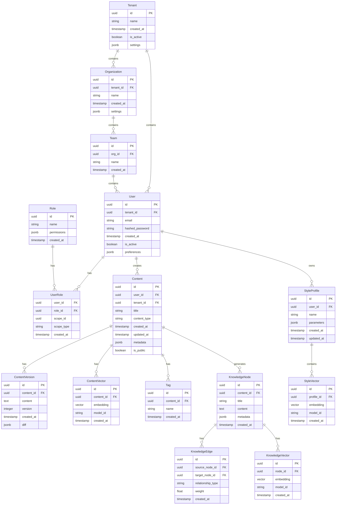

# Data Model Documentation

## Core Entities and Relationships

## Key Relationships Explained

### Multi-tenancy and Organization
- Each `Tenant` represents a separate instance of the application
- `Organization` belongs to a `Tenant` and can have multiple `Teams`
- `User` belongs to a `Tenant` and can be part of multiple `Teams`

### RBAC (Role-Based Access Control)
- `Role` defines permissions at various levels
- `UserRole` links users to roles with specific scopes
- Scope can be at Tenant, Organization, or Team level

### Content Management
- `Content` is the core entity for all written material
- `ContentVersion` tracks revisions and changes
- `ContentVector` stores embeddings for RAG and similarity search
- `Tag` allows for content organization and discovery

### Style Management
- `StyleProfile` captures user's writing style preferences
- `StyleVector` stores embeddings of style characteristics
- Multiple style profiles can be maintained per user

### Knowledge Graph
- `KnowledgeNode` represents concepts or ideas
- `KnowledgeEdge` defines relationships between nodes
- `KnowledgeVector` enables semantic search and relationships

## Vector Storage
All vector-based entities (`ContentVector`, `StyleVector`, `KnowledgeVector`) use pgvector for:
- Similarity search
- Style matching
- Semantic relationships
- RAG operations

## Notes on Implementation

### Indexing Strategy
- B-tree indexes on all foreign keys
- GiST indexes on vector columns for similarity search
- Composite indexes on frequently queried combinations

### Partitioning
- Content and vector tables should be partitioned by tenant_id
- Consider time-based partitioning for version history

### Security
- Row-level security policies based on tenant_id
- Encrypted storage for sensitive fields
- Audit logging on all critical tables

### Performance
- Materialized views for complex aggregations
- Async vector computation
- Caching strategy for frequently accessed data
